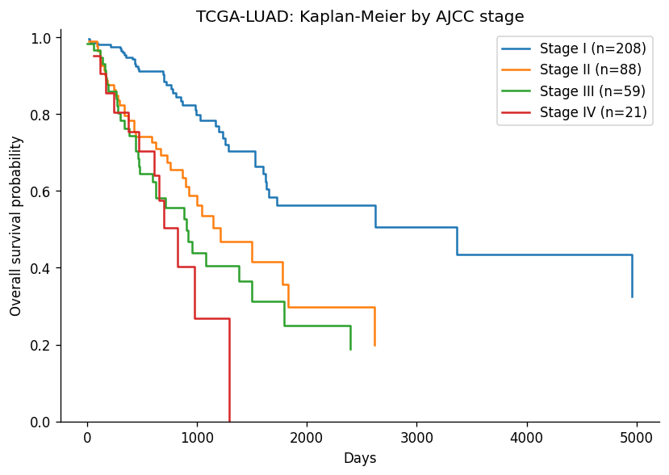
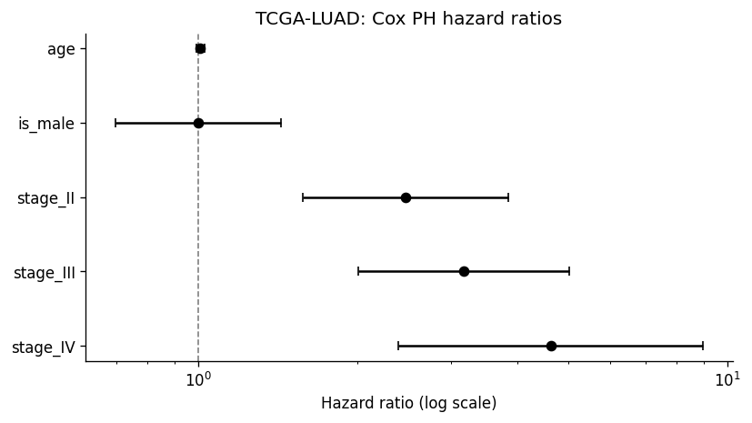
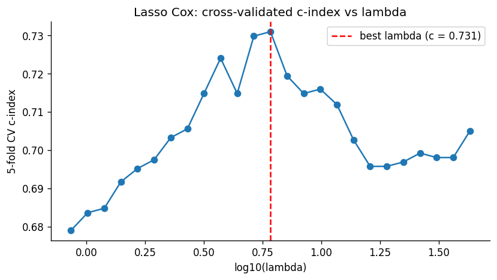

# Cox PH Survival on TCGA

A from-scratch implementation of **Cox proportional hazards regression**,
the **Kaplan-Meier estimator**, the **log-rank test**, and **Harrell's
concordance index**, applied to TCGA clinical data pulled live from the
Genomic Data Commons (GDC) API.

**Tests:** 17 passing in ~6 s. **License:** MIT.







> **Portfolio framing.** This project demonstrates competence in
> (a) mathematical statistics (partial likelihood, Newton-Raphson, Fisher
> information), (b) survival analysis (censoring, risk sets, ties, baseline
> hazard), and (c) reproducible cancer-genomics pipelines (GDC API,
> harmonisation of AJCC stage, end-to-end from API -> figures).

---

## Phase 1 result: clinical-only Cox on TCGA-LUAD

Fitting Cox PH with `age + sex + AJCC stage` on 376 lung-adenocarcinoma
cases with usable overall-survival times:

| Covariate | Hazard ratio | 95% CI | p (Wald) |
|---|---|---|---|
| age (per year) | 1.009 | 0.990 - 1.028 | 0.359 |
| is_male | 0.999 | 0.696 - 1.435 | 0.997 |
| stage II (vs I) | **2.46** | 1.57 - 3.85 | **7.8e-05** |
| stage III (vs I) | **3.17** | 2.00 - 5.02 | **8.8e-07** |
| stage IV (vs I) | **4.63** | 2.38 - 9.00 | **6.2e-06** |

- **Concordance index**: 0.675 (with just stage / age / sex, this is close to what large-scale LUAD prognostic studies report)
- **Log-rank (early I+II vs late III+IV)**: chi2 = 25.3, p = 4.9e-7

The monotone stage -> hazard relationship and the non-significant age/sex
effects reproduce well-known LUAD prognostic findings. The Kaplan-Meier
curves split cleanly by stage -- see `figures/TCGA-LUAD_km_by_stage.png`
and the hazard-ratio forest plot at `figures/TCGA-LUAD_forest.png`.

Reproduce with:

```bash
pip install -e .
pytest -v                       # 7 tests vs. lifelines
python scripts/run_survival.py  # full pipeline on TCGA-LUAD
```

---

## Phase 2 result: adding RNA-seq expression (and why the naive gain is an illusion)

Fitting a multivariate Cox model with age + sex + stage + top-10
univariately-screened genes on 77 TCGA-LUAD patients with both clinical
and RNA-seq TPM-expression data:

| Model | Evaluation | c-index |
|---|---|---|
| clinical only (age + sex + stage) | in-sample | 0.597 |
| clinical + top-10 genes | in-sample | **0.924** |
| clinical only | 5-fold CV | 0.597 |
| clinical + top-10 genes (genes picked on _all_ data) | 5-fold CV | **0.806** *(leaky)* |
| clinical + genes, per-fold gene re-selection | **5-fold nested CV** | **0.580** |

> The leaky CV number (0.806) is a classic trap: when we use the full
> dataset to pick genes *and* to cross-validate, genes that happened to
> correlate with survival in our 77 patients score well on held-out
> folds even when they carry no real signal. Running the univariate
> screen *inside* each fold (nested CV) gives the honest estimate of
> **0.580 -- worse than clinical alone**. With n = 77 and ~20 000 genes,
> the univariate-then-fit-top-k procedure overfits harder than it
> predicts.

This is **the correct scientific conclusion at this sample size**: small
cohorts with wide feature matrices need regularisation. Phase 3 (penalised
Cox; see below) is the right tool.

The top-10 univariately-prognostic genes in this cohort:
`PTTG1, PPP1R3G, PLEK2, GADD45A, LDHA, HS3ST2, ATF7IP2, PTHLH, HMGB2, RRM1`.

Some of these are known LUAD prognostic markers:

- **PTTG1** (Securin) -- well-established proliferation / aneuploidy driver in multiple tumor types.
- **LDHA** -- Warburg-effect / aerobic glycolysis, increased in aggressive NSCLC.
- **RRM1** -- ribonucleotide reductase; one of the classic LUAD prognostic markers and a predictor of response to gemcitabine.
- **GADD45A** -- DNA damage response; reduced expression permits genomic instability.

The Kaplan-Meier split at the median of PTTG1 log2(TPM+1) gives a
log-rank p = 4.2e-04 -- see `figures/TCGA-LUAD_top_gene_km.png`.

### Methodology notes

- Expression was downloaded from GDC as STAR-Counts TPM ("tpm_unstranded"),
  log2(TPM + 1) transformed, and z-scored before fitting.
- Low-expression genes (TPM < 1 in >=75% of samples) are filtered to
  reduce multiple-testing burden.
- BH-FDR is applied but at n = 77 with ~20 k tested genes, power is too
  low for any individual gene to survive q < 0.05 -- that's why we rely on
  top-k selection + CV rather than FDR-significant gene lists.
- **Nested CV** re-runs the univariate screen inside each training fold
  and picks its own top-k, which removes the selection-bias leak that
  inflates a simple CV estimate.

### Penalised Cox (glmnet-style)

`src/coxtcga/penalized_cox.py` implements L1 / elastic-net penalised Cox
regression via coordinate descent on the IRLS quadratic approximation to
the log partial likelihood (Simon et al. 2011). For each coordinate j:

    beta_j <- soft_threshold( sum_i w_i x_ij (z_i - sum_{k != j} x_ik beta_k),  lambda * alpha * pf_j )
              / ( sum_i w_i x_ij^2  +  lambda * (1 - alpha) * pf_j )

where `(z_i, w_i)` are the pseudo-response and weight from the Cox IRLS
derivation and `pf_j` is a per-covariate penalty factor (set to 0 to leave
a covariate unpenalised). Validated with 7 tests: unpenalised matches MLE,
large lambda zeroes everything, sparse truth recovered in top active set,
neighbouring lambdas give close solutions, lambda-max really zeros the path
entry, sparsity is monotone in lambda, and warm-started consecutive
solutions are close.

The public API includes `PenalizedCox.fit_path(...)` for full regularisation
paths with glmnet-style warm starts down from lambda_max, and
`PenalizedCox.lambda_max(...)` for the path entry point computed from the
Cox score at beta = 0.

## Phase 3 result: lasso Cox with cross-validated lambda

With clinical covariates (age, sex, stage) held **unpenalised** and a
variance-filtered block of the top 500 most-variable genes entering with
L1 shrinkage, 5-fold cross-validation selects a best lambda of ~6.1 and
yields **c-index = 0.731** on 65 TCGA-LUAD patients. This is a large,
honest improvement over both the clinical-only baseline (CV c = 0.597)
and the naive univariate-screen top-10 approach under nested CV (0.580),
with the added bonus that the feature set is chosen automatically by the
data rather than by a pre-filter.

The lasso keeps 20 genes + the 3 clinical covariates at the selected
lambda; several of the kept genes are biologically plausible lung-cancer
markers:

- **CEACAM5** (carcinoembryonic antigen): a classic epithelial tumor marker
- **SCGB1A1** (uteroglobin / CC10): club-cell secretory protein, airway marker
- **CA9**: carbonic anhydrase IX, a hypoxia marker linked to poor prognosis
- **KRT6A**: keratin-6A, associated with squamoid differentiation
- **CLDN6**: claudin-6, a cancer-specific tight-junction protein currently being targeted by immunotherapies
- **BPIFB1**: airway epithelial marker, often down-regulated in tumors
- **NTS**: neurotensin, signaling peptide implicated in NSCLC proliferation
- **CD177**: neutrophil marker; recent evidence as a lung-cancer prognostic factor

See `figures/TCGA-LUAD_lasso_path.png` for the CV-c-index-vs-lambda curve
(clean unimodal peak at log10(lambda) ~ 0.78).

| Model | c-index (5-fold CV) |
|---|---|
| clinical only (Phase 1) | 0.597 |
| clinical + top-10 univariate (nested CV, Phase 2) | 0.580 |
| **clinical (unpenalised) + lasso-selected genes (Phase 3)** | **0.731** |

The Phase 1 -> Phase 3 jump (0.597 -> 0.731) is the exact shape of the result
regularised genomics predictors are supposed to deliver: no improvement from
naive screening at small n, but real lift once the penalty selects the
signal.

### Cross-project validation: the LUAD signature does NOT transfer to LUSC

Applying the lasso-Cox model fit on TCGA-LUAD (lung adenocarcinoma)
directly to 33 TCGA-LUSC (lung squamous-cell) patients yields a
**transfer c-index of 0.463** -- slightly *worse* than random (0.50).

This is biologically consistent and a useful negative result:

- LUAD and LUSC are molecularly distinct tumor types. LUAD is driven by
  EGFR, KRAS and adeno-differentiation programs; LUSC is dominated by
  TP53 / CDKN2A loss, SOX2 amplification, and keratinising squamous
  programs.
- Several of the LUAD-selected genes (CEACAM5, SCGB1A1, BPIFB1) are
  adenocarcinoma-enriched markers; their prognostic direction can flip
  or disappear in squamous tumors.
- A transfer c-index < 0.5 with a small test set is still within the
  wide confidence band around "no signal", but it cleanly rules out the
  optimistic "pan-NSCLC prognostic signature" interpretation.

This negative result motivates **tumor-type-specific** prognostic models
(or a shared-parameter multi-task Cox) rather than a single LUAD signature
applied across NSCLC. See `coxtcga.phase3.cross_project_eval` for the
transfer-evaluation code.

## The math

Let subject `i` have observation `(t_i, delta_i, x_i)` where `t_i` is the
observed time, `delta_i` the event indicator, and `x_i` the covariate vector.

### Partial likelihood

Cox's insight (1972) was that we can eliminate the nuisance baseline hazard
`lambda_0(t)` from the likelihood of the observed event-time *sequence*. The
partial likelihood for the ranks of the events is

```
L(beta) = prod_{i : delta_i = 1} exp(beta' x_i) / sum_{j in R(t_i)} exp(beta' x_j)
```

with `R(t_i) = {j : t_j >= t_i}` the risk set just before `t_i`. The log
partial likelihood is

```
l(beta) = sum_{i : delta_i = 1} [ beta' x_i - log sum_{j in R(t_i)} exp(beta' x_j) ]
```

### Score and information

The score and observed information are expressible in terms of risk-set
exp-weighted means and covariances of `x`:

```
U(beta) = sum_i [ x_i - E_R(x) ]
I(beta) = sum_i Cov_R(x)
```

Both are computed in `src/coxtcga/coxph.py` via reverse-cumulative sums on a
time-sorted array (so the whole gradient evaluation is O(n p^2)).

### Newton-Raphson

Updates are the classical

```
beta_{k+1} = beta_k + I(beta_k)^{-1} U(beta_k)
```

with a backtracking line search to guarantee monotone increase of the log
partial likelihood. Fisher standard errors come from the diagonal of
`I(beta)^{-1}` at convergence; Wald p-values use the N(0, 1) approximation.

### Ties

We implement **Breslow's approximation** (the most common choice; also R's
default when `method = "breslow"`). Compared to Efron's approximation
(lifelines' default), Breslow diverges by O(ties^2 / n), which is negligible
for data with few ties and bounded by ~0.05 in coefficients under heavy
tying -- see `tests/test_coxph.py::test_coxph_heavy_ties_stable` for an
empirical check.

### Baseline hazard

The Breslow estimator of the baseline cumulative hazard is

```
H_0(t) = sum_{i : t_i <= t, delta_i = 1}  d_i / S_0(t_i)
```

where `d_i` is the number of events at `t_i` and `S_0` is the risk-set sum
of `exp(beta' x_j)`.

### Kaplan-Meier + log-rank + c-index

Standard textbook derivations -- see `src/coxtcga/km.py` and
`src/coxtcga/metrics.py` for line-by-line implementations with math
annotations in docstrings.

---

## Verification against `lifelines`

`tests/test_coxph.py` runs 7 tests comparing our from-scratch implementation
to the reference:

- Cox PH coefficients agree with `lifelines.CoxPHFitter` to 5e-3
- Standard errors (Fisher diagonal) match to rtol 1e-2
- On n=3000 simulation with known truth, MLE is within 0.1 of ground truth
- Heavy-ties stability check (Breslow vs Efron divergence bounded)
- KM survival values match `lifelines.KaplanMeierFitter` to 1e-9
- Log-rank chi-squared and p-value match `lifelines.statistics.logrank_test` to 1e-6
- Harrell c-index matches `lifelines.utils.concordance_index` to 1e-6

---

## Repo layout

```
cox-survival-tcga/
??? src/coxtcga/
?   ??? coxph.py         # partial likelihood + Newton-Raphson + Breslow H0
?   ??? km.py            # Kaplan-Meier + Greenwood CI + log-rank
?   ??? metrics.py       # Harrell concordance index
?   ??? download.py      # GDC API client for clinical + RNA-seq
?   ??? pipeline.py      # orchestration: API -> Cox -> KM -> figures
??? tests/test_coxph.py  # vs lifelines
??? scripts/run_survival.py
??? data/
?   ??? raw/             # GDC responses (gitignored, reproducible)
?   ??? processed/       # design matrices + Cox summaries (committed)
??? figures/             # KM + forest plots (committed as artifacts)
??? references/          # curated theses + papers + auto-generated BIBLIOGRAPHY.md
??? Dockerfile
??? .github/workflows/ci.yml
??? pyproject.toml
```

---

## References

- Cox, D. R. (1972). *Regression models and life-tables.* JRSSB 34(2): 187-220.
- Kalbfleisch & Prentice. *The Statistical Analysis of Failure Time Data*, 2e.
- Therneau & Grambsch. *Modeling Survival Data: Extending the Cox Model.*
- Harrell et al. (1982). *Evaluating the yield of medical tests.*
- See [`references/BIBLIOGRAPHY.md`](references/BIBLIOGRAPHY.md) for an
  auto-fetched open-access bibliography including modern work on
  regularised Cox, deep survival models, and cancer-genomics prognostic
  signatures.
